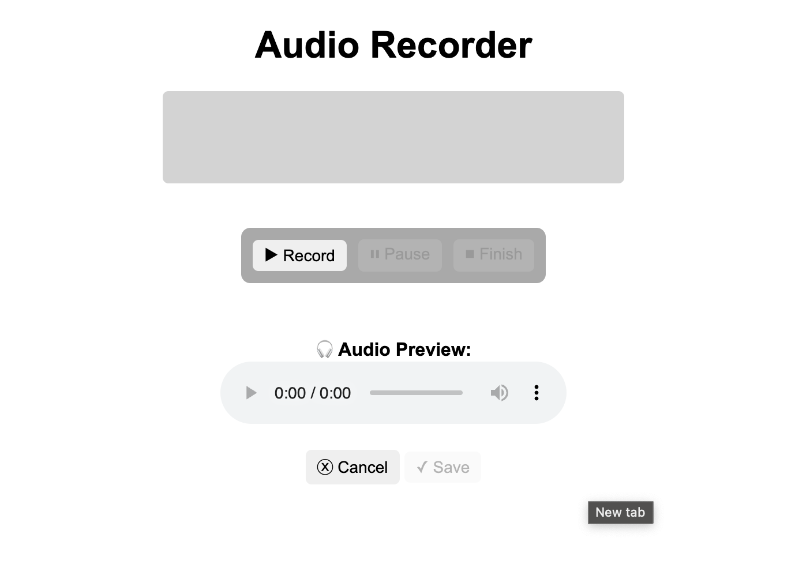

# Audio Recorder Web App

This is a **browser-based audio recorder** that allows users to **record, pause, stop, play back, and save audio recordings** using the **MediaRecorder API** and **Web Audio API**. The app also includes **real-time audio visualization**.

    


---

## **Features**
- **Record audio** using the browser's microphone.  
- **Pause and resume** recording anytime.  
- **Stop and preview** the recorded audio before saving.  
- **Save recording as WebM** (`.webm` format, Opus codec).  
- **Audio visualization** using a frequency bar visualizer.  

---

## **Technologies Used**
- **HTML5** - Structure of the app.
- **CSS3** - Styling and layout.
- **JavaScript (ES6+)** - Core logic for audio recording and visualization.
- **MediaRecorder API** - Enables browser-based audio recording.
- **Web Audio API** - Processes and visualizes audio data.

---

## **Project Structure**
```
js-audio-recorder/
│── index.html # Main HTML file
│── styles.css # Styling for the app 
│── script.js # JavaScript functionality
│── README.md # Documentation (this file)
```

---

## **Installation & Setup**
### **Clone the Repository**
```sh
git clone https://github.com/SelinaMangaroo/JavaScript-Audio-Recorder.git
cd js-audio-recorder
```

### Open in a Browser
Simply open `index.html` in your web browser.

--- 

## How It Works
- The MediaRecorder API captures and stores the microphone audio.
- The Web Audio API analyzes and visualizes the live audio feed.
- The recorded data is stored in chunks and combined into a WebM Blob.
- The user can play back and download the final audio file.

---

## License
This project is licensed under the MIT License.
See LICENSE for details.

